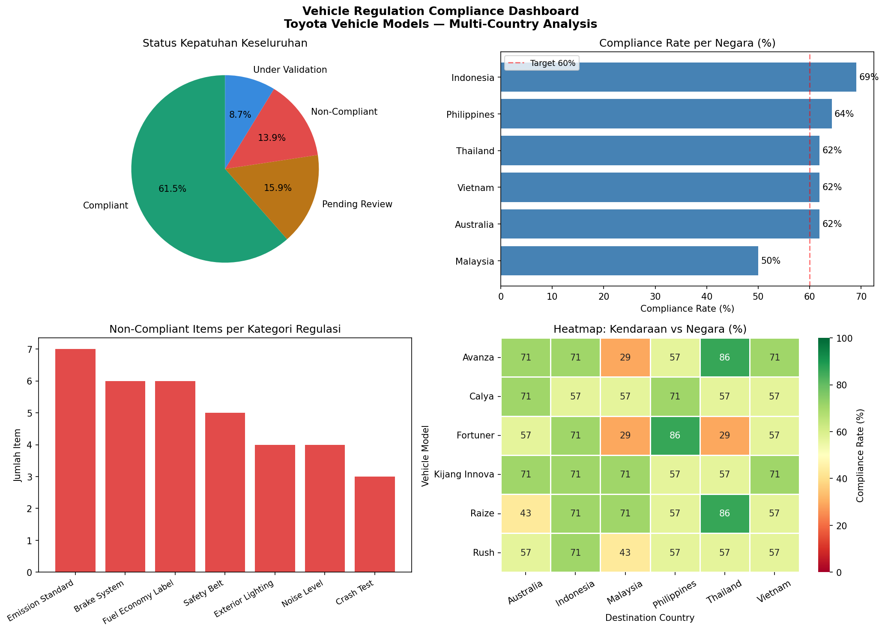

# Vehicle Regulation Compliance Tracker
**by Pujo Trihantoro | Mechanical Engineering Graduate**

## Background
This project simulates ICF (International Certification Framework)
compliance monitoring activities — tracking regulatory requirements
across vehicle models and destination countries, similar to the
workflow used in automotive OEM regulatory departments.

## What it does
- Tracks compliance status for 6 Toyota vehicle models across
  6 destination countries and 7 regulation categories
- Identifies non-compliant items sorted by review deadline
  for immediate action prioritization
- Generates compliance rate analysis by country and vehicle model
- Exports structured Excel reports with automatic color-coding

## Dataset
- 252 regulation check items (6 vehicles × 6 countries × 7 categories)
- Regulation categories: Emission Standard, Brake System, Safety Belt,
  Crash Test, Noise Level, Exterior Lighting, Fuel Economy Label
- Regulation codes based on actual UN/ECE regulation references

## Key Findings
- Overall compliance rate: 61.5% across all models and markets
- Malaysia is the only market below the 60% target at 50%
  — flagged as highest-priority market for compliance action
- Indonesia leads with 69% compliance rate
- Emission Standard (7 items) and Brake System (6 items) are the
  most frequent non-compliant categories
- Fortuner has the lowest vehicle-level compliance at 54.8%
- 35 items flagged for immediate action, with the most urgent
  deadline in January 2025 (Calya — DRL Exterior Lighting,
  Philippines)
  ## Dashboard Preview

## Output files
- `compliance_dashboard.png` — 4-chart compliance overview
- `Vehicle_Regulation_Compliance_Report.xlsx` — 4-sheet Excel report
  with automatic color-coding by status
- `vehicle_regulation_compliance.csv` — full dataset

## Tools
Python · pandas · matplotlib · seaborn · openpyxl · Jupyter Notebook

## Engineering context
As an Automotive Mechanical Engineering graduate with internship
experience in automotive maintenance and aviation compliance
(GMF AeroAsia), I understand that regulatory tracking is not just
data management — it is a critical safety and market-access function.

A vehicle that fails to meet a destination country's emission or
safety regulation cannot legally enter that market. Behind every
compliant vehicle on the road, there is a team tracking hundreds
of items like these. This project reflects that understanding.

## How to Run
1. Clone this repository
2. Install dependencies: pip install pandas numpy matplotlib seaborn openpyxl
3. Open `compliance_tracker.ipynb` in Jupyter Notebook
4. Run all cells from top to bottom
5. Output files will be generated automatically in the same folder
